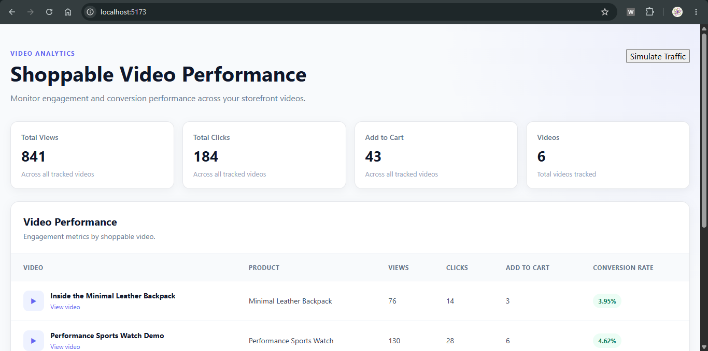

Videoselz Shoppable Video Analytics Dashboard

A full-stack shoppable video analytics dashboard built for the Videoselz Full Stack Developer Take-Home Project — Aug 2026.

The application provides an analytics dashboard for e-commerce merchants to monitor engagement with shoppable videos. It includes a RESTful backend, normalized SQLite database, React dashboard, event ingestion, video-level analytics aggregation, pagination, and simulated traffic.

Features

Responsive React analytics dashboard

Video performance table with:

Views

Clicks

Add to Cart conversions

Frontend-calculated Conversion Rate

Global dashboard KPIs for all tracked videos

Paginated analytics API and dashboard

Simulate Traffic button that:

Selects a random video

Selects a random event type

Sends the event to the backend

Refreshes analytics from the database

Input validation for engagement events

Video existence validation

Centralized API error handling

Health endpoint with database connectivity check

SQLite persistence using Prisma ORM

Seed data for local development

Automated backend API integration tests

Modular React components and CSS

No Tailwind CSS, in accordance with the assignment requirements

Tech Stack

Frontend

React

Vite

JavaScript

CSS

Backend

Node.js

Express

JavaScript / ESM

REST API

Database

SQLite

Prisma ORM 7

@prisma/adapter-better-sqlite3

better-sqlite3

Testing

Vitest

Supertest

Architecture

                        ┌──────────────────────┐
                        │   React Dashboard    │
                        │      Vite / CSS      │
                        └──────────┬───────────┘
                                   │
                         REST / JSON requests
                                   │
                                   ▼
                        ┌──────────────────────┐
                        │    Express API       │
                        │ Routes / Controllers │
                        └──────────┬───────────┘
                                   │
                                   ▼
                        ┌──────────────────────┐
                        │      Services        │
                        │ Business / Analytics │
                        └──────────┬───────────┘
                                   │
                                   ▼
                        ┌──────────────────────┐
                        │       Prisma         │
                        │ SQLite Adapter       │
                        └──────────┬───────────┘
                                   │
                                   ▼
                        ┌──────────────────────┐
                        │       SQLite         │
                        │ products / videos /  │
                        │ engagement_events    │
                        └──────────────────────┘

Backend request flow

HTTP Request
    ↓
Route
    ↓
Controller
    ↓
Service
    ↓
Prisma
    ↓
SQLite

This keeps HTTP concerns, validation, business logic, and database access separated.

Project Structure

videoselz-shoppable-analytics/
│
├── client/
│   ├── src/
│   │   ├── components/
│   │   │   ├── AnalyticsTable/
│   │   │   ├── DashboardHeader/
│   │   │   ├── MetricCard/
│   │   │   ├── Pagination/
│   │   │   └── TrafficButton/
│   │   ├── services/
│   │   │   └── analyticsApi.js
│   │   ├── App.jsx
│   │   ├── App.css
│   │   └── index.css
│   └── package.json
│
├── server/
│   ├── prisma/
│   │   ├── migrations/
│   │   ├── schema.prisma
│   │   └── seed.ts
│   ├── src/
│   │   ├── controllers/
│   │   ├── db/
│   │   ├── generated/
│   │   ├── middleware/
│   │   ├── routes/
│   │   ├── services/
│   │   ├── app.js
│   │   ├── app.test.js
│   │   └── server.js
│   ├── prisma7.config.ts
│   └── package.json
│
├── AI_PROMPTING.md
├── README.md
└── .gitignore

server/src/generated/ is generated by Prisma and should not be committed if it is included in .gitignore.

Database Design

The database is normalized around three entities:

Product 1 ─────── N Video 1 ─────── N EngagementEvent

Products

Column

Description

id

Primary key

name

Product name

price

Product price

createdAt

Creation timestamp

Videos

Column

Description

id

Primary key

productId

Foreign key to Products

videoUrl

Video URL

title

Video title

EngagementEvents

Column

Description

id

Primary key

videoId

Foreign key to Videos

eventType

view, click, or add_to_cart

timestamp

Event timestamp

API Documentation

Health

GET /api/health

Example response:

{
  "success": true,
  "message": "Videoselz Analytics API is running",
  "database": "connected"
}

Create Engagement Event

POST /api/events
Content-Type: application/json

Request:

{
  "videoId": 1,
  "eventType": "view"
}

Supported event types:

view
click
add_to_cart

Successful response:

{
  "success": true,
  "message": "Engagement event created successfully",
  "data": {
    "id": 1001,
    "videoId": 1,
    "eventType": "view",
    "timestamp": "2026-08-27T00:00:00.000Z"
  }
}

Validation includes:

Required videoId and eventType

Positive integer videoId

Supported event type

Existing video check

Video Analytics

GET /api/analytics/videos

Pagination:

GET /api/analytics/videos?page=1&limit=5

Example response:

{
  "success": true,
  "data": [
    {
      "id": 6,
      "title": "Inside the Minimal Leather Backpack",
      "videoUrl": "https://example.com/videos/leather-backpack.mp4",
      "productName": "Minimal Leather Backpack",
      "views": 75,
      "clicks": 14,
      "addToCart": 3
    }
  ],
  "summary": {
    "views": 840,
    "clicks": 183,
    "addToCart": 42
  },
  "pagination": {
    "page": 1,
    "limit": 5,
    "total": 6,
    "totalPages": 2
  }
}

The backend returns raw metrics. The frontend calculates:

Conversion Rate = (Add to Cart / Views) × 100

A zero-view video displays 0.00% rather than NaN or Infinity.

Local Setup

Prerequisites

Node.js 22+

npm

Git

1. Clone the repository

git clone https://github.com/AshimKr/videoselz-shoppable-analytics
cd videoselz-shoppable-analytics

2. Install root dependencies

npm install

3. Install frontend dependencies

cd client
npm install
cd ..

4. Install backend dependencies

cd server
npm install

5. Configure backend environment

Create:

server/.env

with:

PORT=5000
DATABASE_URL="file:./dev.db"
CLIENT_URL=http://localhost:5173

6. Configure frontend environment

Create:

client/.env

with:

VITE_API_BASE_URL=http://localhost:5000/api

7. Generate Prisma Client

From server:

npx prisma generate

8. Apply database migrations

From server:

npm run db:migrate

9. Seed the database

From server:

npm run db:seed

10. Start the backend

From server:

npm run dev

Backend:

http://localhost:5000

Health check:

http://localhost:5000/api/health

11. Start the frontend

In another terminal:

cd client
npm run dev

Frontend:

http://localhost:5173

Server Scripts

From server/:

npm run dev

Starts the development server with watch mode.

npm start

Starts the production Node.js server.

npm run db:migrate

Creates/applies Prisma development migrations.

npm run db:seed

Runs the configured Prisma seed script.

npm run db:studio

Opens Prisma Studio.

npm test

Runs the backend API test suite.

Testing

The backend includes integration tests covering:

Health endpoint

Video analytics retrieval

Analytics pagination

Invalid pagination

Event creation

Unsupported event types

Nonexistent videos

Missing event fields

Unknown API routes

Run:

cd server
npm test

All tests should pass before submission. The final test count should match the tests currently committed in server/src/app.test.js.

The tests use the application's Express app and Prisma-backed SQLite database.

Key Design Decisions

1. Layered backend architecture

Routes only define HTTP paths. Controllers handle request/response concerns, while services contain business and database logic.

2. Normalized relational data

Products, Videos, and EngagementEvents are separate entities connected through foreign keys, avoiding duplicated product/video metadata in events.

3. LEFT JOIN for analytics

Analytics uses a LEFT JOIN from videos to engagement events so videos with zero engagement are still included in the dashboard.

4. Frontend conversion rate

Conversion rate is calculated in React because the assignment explicitly requires the calculation on the frontend.

5. Prisma 7 + SQLite adapter

The project uses Prisma 7's generated client and the Better SQLite3 driver adapter.

6. Server-side pagination

Pagination is applied at the database query level rather than loading the full dataset into React.

7. Real traffic simulation

The Simulate Traffic button creates a real database event through POST /api/events and then refetches analytics. It does not fake metric changes in frontend state.

Validation and Error Handling

The API handles:

400 Bad Request

for malformed pagination and event payloads.

404 Not Found

for nonexistent videos and unknown routes.

503 Service Unavailable

for database health-check failures.

Unexpected errors are handled through centralized Express error middleware.

Git History

The repository was developed through incremental commits rather than a single final commit.

Example progression:

chore: initialize full stack project
feat: configure sqlite database and seed analytics data
feat: implement engagement and video analytics APIs
feat: polish analytics dashboard and harden API
test: add backend API integration tests

Assignment Compliance

The implementation addresses the requested technical requirements:

React frontend

Node.js/Express backend

SQLite SQL database

Products entity

Videos entity

EngagementEvents entity

POST /api/events

GET /api/analytics/videos

Aggregated Views, Clicks, and Add to Cart

Pagination

Frontend conversion rate

Simulate Traffic

Responsive dashboard

No Tailwind CSS

Public Git repository

README setup instructions

AI_PROMPTING.md

Public Project Links

GitHub Repository

Replace with the final public repository URL:

https://github.com/AshimKr/videoselz-shoppable-analytics

Other Public Repositories / Contributions

The assignment asks for links to public repositories where significant personal/open-source contributions are shown.

https://github.com/AshimKr/webpilot-ai
https://github.com/AshimKr/dev-ashimkr-ME_QKART_FRONTEND_V2

Remove entries that do not apply.

Videos

30-Second Candidate Pitch

Required by the assignment.

<YOUR_UNLISTED_YOUTUBE_PITCH_URL>

Technical Walkthrough

Required 3–5 minute project walkthrough.

https://www.loom.com/share/0a62391c7649439b9216c37e428cb32f

Screenshots

Add final screenshots here before submission.

Suggested files:

docs/
├── dashboard.png
├── analytics-table.png
└── api-response.png

Example:

